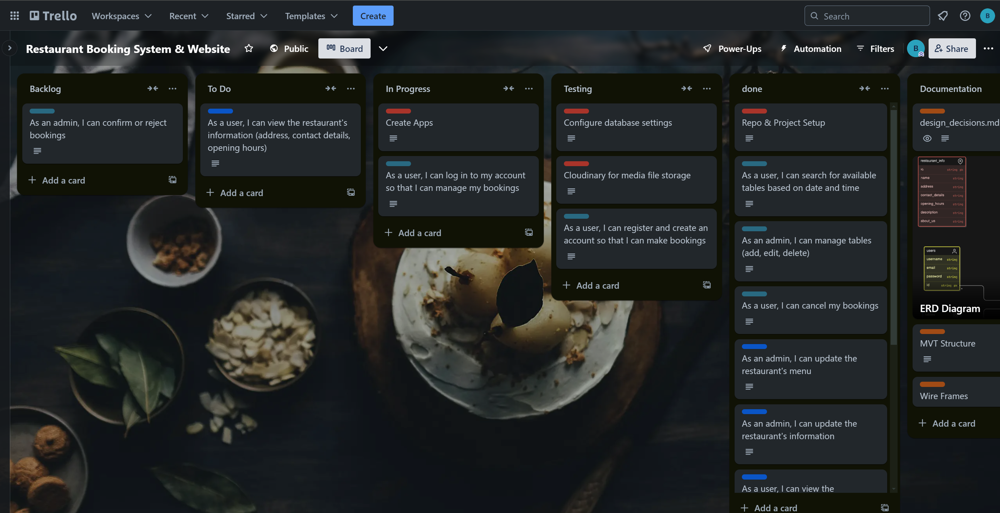
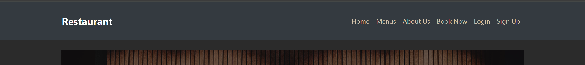
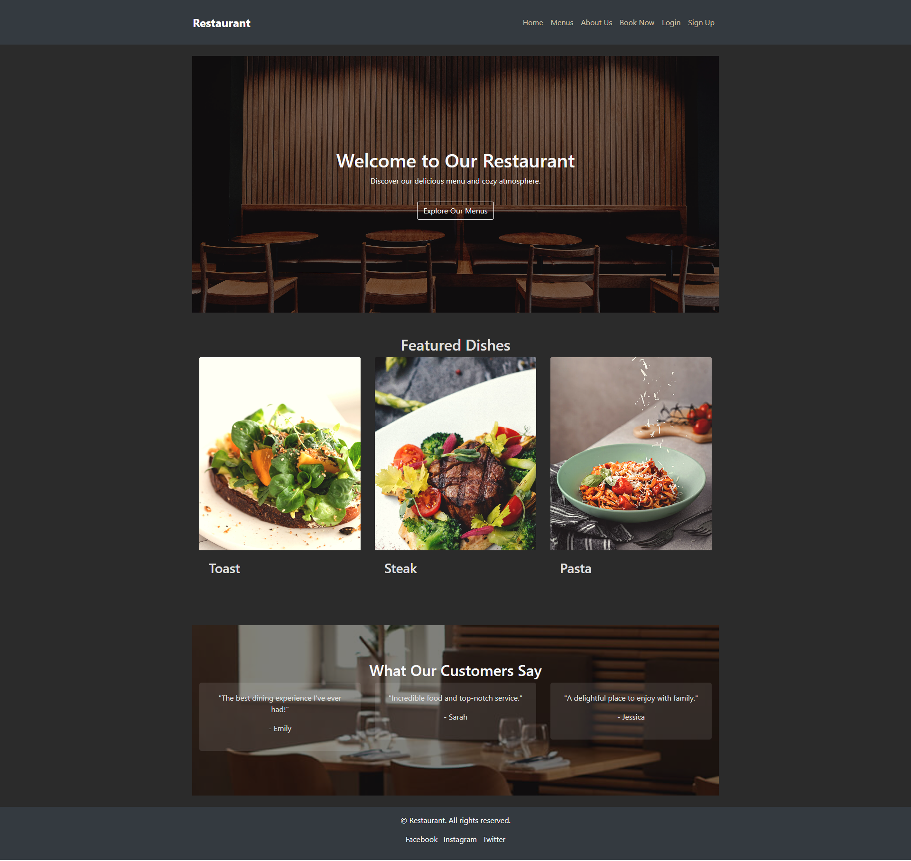
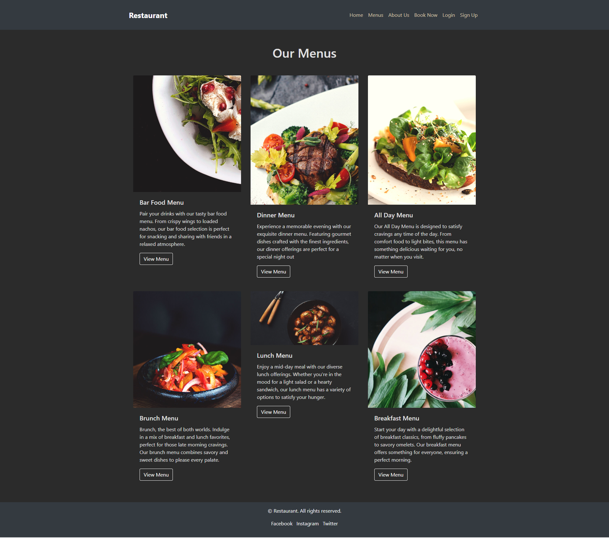
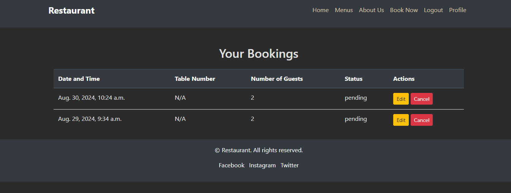
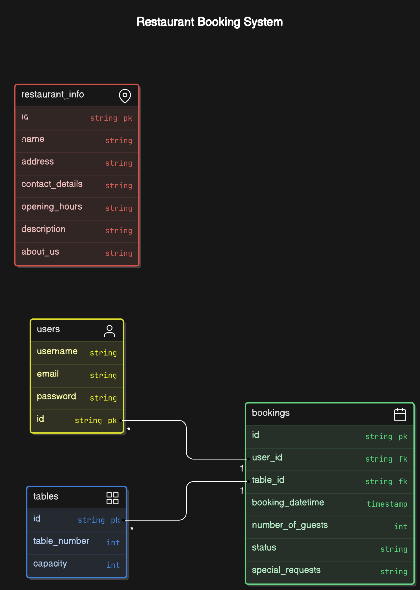

# Restaurant Booking System

A Django-based web application for restaurant reservations, allowing users to browse the menu, book tables, and manage their bookings online. The application integrates with Cloudinary for media storage and uses Django Allauth for user authentication.

## Table of Contents

1. [Project Overview](#project-overview)
2. [UX (User Experience)](#ux-user-experience)
3. [Features](#features)
4. [Technologies Used](#technologies-used)
5. [Testing](#testing)
6. [Deployment](#deployment)
7. [Credits](#credits)
8. [Acknowledgements](#acknowledgements)

---

## Project Overview

The Restaurant Booking System is a full-stack web application built with Django. It allows users to book tables, view the restaurant menu, and manage their reservations. The application is designed with both end-users and administrators in mind, providing an easy-to-use interface for customers and a robust admin panel for restaurant staff.

## UX (User Experience)

### Epics and User Stories

**Epic: Booking System**

*   **User Registration and Login**
    *   As a user, I can register and create an account so that I can make bookings.
    *   As a user, I can log in to my account so that I can manage my bookings.

*   **Table Booking & Management**
    *   As a user, I can search for available tables based on date and time.
    *   As a user, I can select a table and make a reservation.
    *   As a user, I can view my upcoming and past bookings.
    *   As a user, I can cancel my bookings.
    *   As an admin, I can view all bookings.
    *   As an admin, I can manage tables (add, edit, delete).
    *   As an admin, I can confirm or reject bookings.

**Epic: Restaurant Website**

*   **Restaurant Information & Menu**
    *   As a user, I can view and edit the restaurant's information (address, contact details, opening hours).
    *   As a user, I can view and edit the restaurant's menu.

---

## Agile Methodology and Project Management

The Agile methodology was employed to guide the development of this project. I utilized Trello as our project management tool, creating a Kanban board to visualize and track progress. The board was organized into the following sections:

*   **Backlog**
*   **To Do**
*   **In Progress**
*   **Testing**
*   **Done**

Trello cards were used to represent User Stories, bug fixes, and other project tasks. Each card included a clear title, description, and any relevant labels or assignments. 

I divided the project into three distinct sprints, each with a defined timeline. User Stories were prioritized and assigned to specific sprints, ensuring a focused and manageable workload. While I successfully completed all planned sprints on time, three enhancement features were deferred to future development and are listed under "Future Features."

Trello served as a valuable tool not only for tracking User Stories but also for documenting and addressing any bugs or updates throughout the development process.

### Wireframes

Wireframes were created using Balsamiq to plan the layout and structure of the application. These wireframes guided the development process, ensuring a user-friendly design.

---

## Design Choices

### 1. **Color Palette**
The color palette for this project was carefully selected to create a sleek, modern, and earthy aesthetic that aligns with the theme of a high-end restaurant. The colors chosen are intended to provide a dark, elegant backdrop, with contrasting elements that ensure readability and visual appeal. Below is the primary color palette used throughout the site:

- **Primary Color**: `#2B2B2B` (Dark Charcoal)  
  Used as the main background color for its sophisticated and minimalist appearance.
  
- **Accent Color**: `#E09F3E` (Golden Orange)  
  Utilized for call-to-action buttons, links, and other elements requiring emphasis, adding warmth and vibrancy to the design.
  
- **Text Color**: `#E0E0E0` (Light Gray)  
  The primary text color, chosen to contrast well with the dark background, ensuring readability.

- **Link Color**: `#D5C3AA` (Soft Beige)  
  Used for links and navigation items to provide a subtle, yet noticeable, contrast against the dark background.
  
- **Hover Color**: `#D28E36` (Muted Gold)  
  A slightly muted version of the accent color, used for hover states to create a smooth and cohesive interaction experience.

- **Secondary Background Color**: `#5C5C5C` (Dim Gray)  
  Applied to secondary sections and elements like footers to differentiate them from the main content without overwhelming the user.

### 2. **Typography**
The typography chosen for this project is designed to be clean and modern, ensuring that content is easy to read while maintaining a professional appearance. The primary font used is:

- **Font**: `Arial, sans-serif`  
  A classic, neutral font that complements the minimalist design approach.

### 3. **Layout**
The layout of the site follows a clean, grid-based structure, ensuring that content is well-organized and accessible across different devices. Key layout decisions include:

- **Responsive Design**: The site is fully responsive, ensuring a seamless experience on both desktop and mobile devices.
- **Grid System**: Bootstrap's grid system is employed to create a flexible, consistent layout across all pages.
- **Content Hierarchy**: Clear visual hierarchy is established through the use of varying font sizes, bold text for headings, and sufficient spacing between elements.

### 4. **Visual Elements**
- **Images**: High-quality, visually appealing images are used throughout the site, with consistent sizing and placement to maintain a uniform look and feel.
- **Buttons**: Call-to-action buttons are styled with the accent color and are strategically placed to guide users through the site’s key actions, such as booking a table or exploring the menu.

### 5. **Accessibility Considerations**
- **Contrast**: Text and interactive elements maintain a high contrast ratio against the background to ensure readability for users with visual impairments.
- **Alt Text**: All images include descriptive alt text to improve accessibility for screen readers.

### 6. **User Experience**
The user experience is designed to be intuitive and enjoyable, with a focus on making it easy for users to navigate the site, find information, and complete actions such as making a booking or exploring the menu. This is achieved through:

- **Clear Navigation**: A simple, easy-to-use navigation bar is present on all pages.
- **Consistent Design**: Consistency in design elements such as colors, typography, and layout helps users feel familiar and comfortable as they interact with different parts of the site.

### 7. **Future Enhancements**
Looking ahead, there are several design enhancements that could further improve the user experience, such as:

- **Update Admin UI**: Adding more controls and filtering option to allow superusers to complete tasks efficiently
- **Social Logins**: Introducing social logins to streamline the booking process.
- **Email Confirmations**: Add email functionality to confirm books, changes and cancellations 

---

This section outlines the key design choices that were made to create a visually appealing, functional, and accessible website. Each decision was made with the end user in mind, ensuring that the site not only looks great but also provides a seamless and enjoyable experience.

## Features

### Implemented Features

### Navigation (Nav)
The navigation bar is prominently displayed across the top of every page, providing users with easy access to all major sections of the site. It includes links to the Home, Menus, About Us, Contact Us, Profile, Login, and Signup pages, ensuring a seamless browsing experience.

### Home Page Layout
The Home page features a welcoming hero section with a background image, title, and call-to-action button. Below, it showcases featured dishes in a grid layout, followed by customer testimonials to build trust and appeal.

### Menu Page
The Menu page displays all available menus in a series of long cards. Each card contains an image, title, and a brief description of the menu, inviting users to explore the details of the restaurant’s offerings.

### About Us Page
The About Us page provides a glimpse into the restaurant's history and values, with sections dedicated to the team, the restaurant’s journey, and a photo gallery that highlights the ambiance and experience.

### Book Now/Contact Us Page
The Contact Us page combines essential contact details with a booking form, allowing users to get in touch or make a reservation easily. It includes fields for email, phone number, and address, all styled for clarity and accessibility.

### Login Page
The Login page offers a simple, secure form for users to sign into their accounts. The design is clean and straightforward, focusing on providing a hassle-free login experience.

### Profile Page
The Profile page allows users to view and manage their bookings. It lists current reservations with options to edit or cancel them, ensuring users have full control over their dining plans.

### Signup Page
The Signup page features a user-friendly registration form that enables new users to create an account quickly. The page is designed with simplicity in mind, guiding users through the process with clear instructions and fields.

## Technologies Used

- **Django**: The main web framework used to build the application.
- **HTML/CSS/JavaScript**: For structuring, styling, and adding interactivity to the web pages.
- **Bootstrap**: For responsive design and UI components.
- **PostgreSQL**: The database management system used in production.
- **SQLite**: Used as the database during development.
- **Cloudinary**: For media storage and management.
- **Django Allauth**: For handling user authentication.
- **Heroku**: For deploying the application to the cloud.
- **Git/GitHub**: For version control and repository hosting.

## Project Dependencies

### Core Django Packages
- **Django==4.2.15**: The web framework used to build the application, providing tools for routing, views, ORM, and more.
- **django-allauth==64.1.0**: A Django app for handling user authentication, registration, and account management, with support for social logins.
- **django-crispy-forms==2.3**: Provides tools to easily style Django forms using a chosen CSS framework, such as Bootstrap.
- **django-summernote==0.8.20.0**: A WYSIWYG editor integrated into Django forms, allowing rich text editing capabilities within the admin and forms.
- **sqlparse==0.5.1**: A library used by Django for parsing SQL queries, especially useful in the Django admin and ORM.

### Deployment and Database Management
- **gunicorn==20.1.0**: A Python WSGI HTTP Server for running Django applications in production.
- **psycopg2==2.9.9**: A PostgreSQL adapter for Python, used to connect Django to a PostgreSQL database.
- **dj-database-url==0.5.0**: Allows configuring the Django database connection using a single URL, simplifying database setup, especially in deployment environments.
- **whitenoise==6.5.0**: Simplifies serving static files in Django applications, making it easier to deploy to platforms like Heroku.

### Cloudinary Integration
- **cloudinary==1.36.0**: Python SDK for integrating Cloudinary, used to manage and deliver media assets like images and videos.
- **dj3-cloudinary-storage==0.0.6**: A Django storage backend for Cloudinary, allowing media files to be uploaded directly to Cloudinary from the Django application.

### HTML and Form Handling
- **bleach==4.1.0**: A library for sanitizing HTML, often used to clean up user input to prevent XSS attacks.
- **django-summernote==0.8.20.0**: A WYSIWYG editor integrated into Django forms, allowing rich text editing capabilities within the admin and forms.
  
### HTTP and Request Handling
- **requests==2.32.3**: A simple and intuitive HTTP library used for making HTTP requests in Python applications.
- **urllib3==1.26.19**: A powerful HTTP library for Python, often used by `requests` for managing connections and requests.
- **idna==3.8**: Provides support for Internationalized Domain Names (IDN), used in handling URLs in requests.

### Utility Libraries
- **asgiref==3.8.1**: A reference implementation of the ASGI (Asynchronous Server Gateway Interface) standard, used by Django for async support.
- **certifi==2024.7.4**: Provides a curated collection of Root Certificates for SSL/TLS verification, ensuring secure HTTP connections.
- **charset-normalizer==3.3.2**: Used for detecting and normalizing character encodings, ensuring text data is correctly processed.
- **six==1.16.0**: A utility library for writing Python code that is compatible with both Python 2 and 3.
- **packaging==24.1**: Provides utilities for parsing and handling package versions and dependencies in Python projects.
- **typing_extensions==4.12.2**: Provides backports of new type system features in Python, helping maintain compatibility across Python versions.
- **webencodings==0.5.1**: A library for handling character encodings used in web documents, especially relevant in HTML parsing and rendering.

## Database Diagram

## Testing

### Manual Testing

All features were manually tested by navigating through the website, submitting forms, and interacting with the UI. Specific user stories were tested as follows:

- **Booking a Table**: Tested by creating, updating, and canceling bookings as both logged-in and logged-out users.
- **Menu Navigation**: Verified that all menu items display correctly and are linked to their respective detail pages.

### Automated Testing

Automated tests were written for the models, views, and forms using Django’s built-in testing tools. These tests ensure that:

- Models correctly handle data validation and relationships.
- Views render the correct templates and handle form submissions as expected.
- Forms enforce correct validation rules.

### Bugs and Fixes

During development, several bugs were encountered:

- **Bug**: Incorrect redirect after booking creation.
  - **Fix**: Updated the view to redirect to the booking list instead of a template.

## Deployment

### Project Setup and Development

This project was initiated on GitHub and developed in VS Code. The following steps outline the setup and development process:

1. A new repository was created - NO template used.
2. The repository was given a meaningful name and created on GitHub.
3. The repository was then opened in VS Code via wls2 and a virtual environment.
4. Version control was maintained throughout the project using the following Git commands:
   - `git add .` or `git add "file name"`: Stages changes for commit.
   - `git commit -m "Description of the update"`: Commits the staged changes to the local repository.
   - `git push`: Pushes committed changes to the GitHub repository.

### Heroku Deployment

The project was deployed on Heroku, and the live application can be accessed [here](https://pp4-restaurant-booking-app-7cc89317a653.herokuapp.com/). Below are the key steps involved in deploying this project using the Heroku platform.

1. **Prepare for Deployment:**
   - Ensure all dependencies are listed in `requirements.txt` by running `pip3 freeze > requirements.txt`.
   - Create a `Procfile` with the content: `web: gunicorn projectname.wsgi`.

2. **Create .slugignore File:**
   - Add `/documentation`, `README.md`, and `TESTING.md` to `.slugignore` to prevent these files from being uploaded to Heroku.

3. **Using the Heroku CLI:**
   - **Login:** Run `heroku login -i` to authenticate the CLI with your Heroku account.
   - **Create an App:** Run `heroku create myappname` to create a new app, ensuring the app name is unique.

5. **Static and Media Files:**
   - Integrate Cloudinary for media file storage by installing `cloudinary` and adding the Cloudinary URL to the environment variables.
   - Configure static and media file settings in `settings.py` to use Cloudinary for storage.

### Local Deployment

You can also deploy the project locally using one of the following methods:

1. **Forking the Repository:**
   - Log in to your GitHub account and navigate to the repository.
   - Click the 'Fork' button to create a copy of the repository in your GitHub account.

2. **Cloning the Repository with GitPod:**
   - Copy the repository URL from the 'Code' button on GitHub.
   - Open a new GitPod workspace and clone the repository using `git clone [URL]`.

3. **Using GitHub Desktop:**
   - Click the 'Code' button and select 'Open with GitHub Desktop' to clone the repository locally.
   - Follow the prompts to install GitHub Desktop if necessary.

## Resources and References

### Inspiration and Learning

Throughout the development of this project, several key resources provided both inspiration and practical guidance:

- **Code Institute's "I Think Therefore I Blog"**: This course module was instrumental in setting up the core components of the site.
- **Django Blog Tutorial**: A comprehensive guide that helped in structuring the initial foundation of this project.
- **

### Helpful Tools and Guides

During development, these resources were invaluable in solving challenges and optimizing the project:

- **W3Schools - Python**: A go-to reference for Python syntax and examples.
- **Stack Overflow**: An essential resource for troubleshooting code issues and finding quick solutions.
- **Django Documentation**: The official Django documentation was frequently referenced for understanding framework features and best practices.
- **Django Testing Resources**: Various guides on Django testing, including cheat sheets and detailed explanations, were used to ensure the reliability of the application.
- **Django User Profile Management**: Guides and examples on managing user profiles within Django, including integration with Django Allauth.
- **Summernote**: Implemented for rich text editing within the application.

### Special Mentions

This project could not have been completed without the support and advice from the following:

- **Code Institute Community**: The Slack community was a great source of support, offering help and encouragement throughout the development process.
- **Stack Overflow Contributors**: The Stack Overflow community played a crucial role in overcoming some of the more challenging coding obstacles.
- **Google**: Countless searches provided answers to specific problems and offered insights into best practices.

### Final Thoughts

Developing this project was a challenging but rewarding experience, made possible by the wealth of resources available online and the support of the development community. Every piece of advice, tutorial, and snippet of code contributed to the final product, and I am grateful for all the help received along the way.
